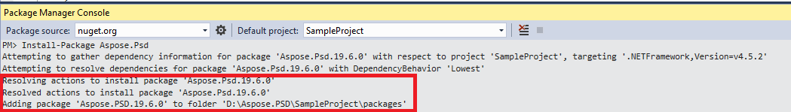

## **Cài đặt Aspose.PSD cho .NET thông qua NuGet**
NuGet là cách dễ dàng nhất để tải về và cài đặt API Aspose cho .NET. Mở Microsoft Visual Studio và quản lý gói NuGet. Tìm "aspose" để tìm API Aspose mong muốn. Nhấn vào "Cài đặt", API được chọn sẽ được tải về và tham chiếu trong dự án của bạn.

## **Cài đặt hoặc Cập nhật Aspose.PSD bằng Package Manager Console**
Bạn có thể tuân theo các bước dưới đây để tham chiếu [API Aspose.PSD](https://www.nuget.org/packages/Aspose.psd/) bằng cửa sổ quản lý gói:

1. Mở giải pháp/dự án của bạn trong Visual Studio.
1. Chọn Tools -> Library Package Manager -> Package Manager Console từ menu để mở cửa sổ quản lý gói.

Gõ lệnh "**Install-Package Aspose.Psd**" và nhấn enter để cài đặt bản phát hành mới nhất vào ứng dụng của bạn. Hoặc bạn có thể thêm hậu tố "**-prerelease**" vào lệnh để chỉ định rằng bản phát hành mới nhất bao gồm các bản vá nóng cũng sẽ được cài đặt.

Bạn sẽ thấy dòng chữ **"Đang cài đặt Aspose.PSD"** xuất hiện ở dưới cửa sổ chỉ ra rằng quá trình tải đang diễn ra.

Sau khi tải xuống, bạn sẽ thấy các thông báo xác nhận sau. Nếu bạn chưa quen với [Aspose EULA](https://company.aspose.com/legal/eula) thì nên đọc giấy phép được tham chiếu trong URL.

Bạn nên thấy rằng Aspose.PSD đã được thêm và tham chiếu thành công trong ứng dụng của bạn.

Trong cửa sổ quản lý gói, bạn cũng có thể sử dụng lệnh "**Update-Package Aspose.Psd**" và nhấn enter để kiểm tra có cập nhật nào cho gói Aspose.Psd và cài đặt nó nếu có. Bạn cũng có thể thêm hậu tố "-prerelease" để cập nhật bản phát hành mới nhất.

## **Các Lưu ý Khi Chạy trên Môi trường Máy chủ Chia sẻ**
Các thành phần Aspose .NET đề nghị chạy với tập quyền Full Trust. Điều này là vì các thành phần Aspose .NET đôi khi cần truy cập các thiết lập registry và tệp được đặt ở nơi khác ngoài thư mục ảo, chẳng hạn để đọc font v.v. Hơn nữa, các thành phần Aspose.NET dựa trên các lớp hệ thống .NET core, một số trong số đó cũng yêu cầu quyền Full Trust để chạy trong một số trường hợp.

Các nhà cung cấp dịch vụ Internet (ISP) đang lưu trữ nhiều ứng dụng từ các công ty khác nhau thường thực hiện mức độ bảo mật Medium Trust. Trong trường hợp của .NET 2.0, mức độ bảo mật như vậy có thể thiết lập các ràng buộc sau đây có thể ảnh hưởng đến khả năng của Aspose.Words để hoạt động đúng cách.

- **RegistryPermission** không khả dụng. Điều này có nghĩa là bạn không thể truy cập registry, điều đó cần thiết để liệt kê các font đã cài khi hiển thị tài liệu.
- **FileIOPermission** bị hạn chế. Điều này có nghĩa là bạn chỉ có thể truy cập các tệp trong cấu trúc thư mục ảo của ứng dụng của bạn. Điều này có thể ngụ ý rằng font không thể đọc trong quá trình xuất.

Vì các lý do đã nêu ở trên, đề nghị Aspose.PSD chạy trên quyền Full Trust. Bạn có thể thấy rằng một số tính năng của thư viện sẽ hoạt động khi thực hiện các nhiệm vụ khác nhau ở mức độ Medium trust trong khi một số không (ví dụ như hiệu quả) có thể do cuộc gọi đến xử lý hình ảnh GDI+.

## **Làm việc với DLL .NET Core được cài đặt qua gói MSI**

**Vui lòng lưu ý:** nếu bạn sử dụng DLL .Net Standard được cài đặt qua gói MSI bạn nên thêm các phụ thuộc cần thiết để làm việc với phiên bản .Net Standard.

|**Ảnh chụp màn hình các phụ thuộc của Visual Studio**|**Đoạn mã CsProj file:**|
| :- | :- |
||<ItemGroup>

`    `<PackageReference Include="System.Drawing.Common" Version="4.5.1" />

`    `<PackageReference Include="System.Text.Encoding.CodePages" Version="4.5.0" />

</ItemGroup>|

## **Yêu Cầu Hệ thống**
### **Hệ điều hành hỗ trợ:**
- Microsoft Windows 2000 Professional và Server (SP2 được khuyến nghị)
- Microsoft Windows XP Professional và Home Edition
- Microsoft Windows 2003 Server
- Microsoft Windows Vista
- Microsoft Windows 2008 Server
- Microsoft Windows 2008 Server R2
- Microsoft Windows 7
- Microsoft Windows 8
- Microsoft Windows 10
- Microsoft Windows 11

### **Nền tảng hỗ trợ:**
- Window forms
- Web forms
- Visual Studio 2005
- Visual Studio 2008
- Visual Studio 2010
- Visual Studio 2012
- Visual Studio 2013
- Visual Studio 2015
- Visual Studio 2017
- Visual Studio 2019
- Visual Studio 2022

Aspose.PSD hoạt động cho cả phiên bản x86 và x64 của các hệ điều hành được liệt kê ở trên.
### **Khung công cụ hỗ trợ:**
Aspose.PSD cho .NET hỗ trợ khung.NET như sau:

- .NET Framework phiên bản 2.0 hoặc cao hơn
- .NET Standard 2.0
