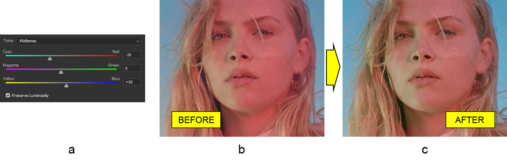

# 在Java中使用Photoshop颜色平衡调整图层

在本文中，我们将使用名为Aspose.PSD for Java的特殊库在Java中调整PSD文件格式中图像的**颜色平衡**。这是一个用于操作Photoshop文档的工具箱。

由于该库与PSD文件格式一起工作，因此它包含几乎与Photoshop编辑器中提供的[所有功能](https://docs.aspose.com/psd/java/features/)，并且**颜色平衡调整图层**也不例外，绝对适用于这项任务。

颜色平衡调整图层使得可以简单且快速地改变阴影、中间色调和高光中主要（RGB）和减法（CMY）颜色之间的平衡。

## 调整颜色平衡

如前所述，在Aspose.PSD for Java中的颜色平衡调整图层就是**主要和减法颜色之间的平衡器**。这意味着每种颜色对有三个刻度（青/红，洋红/绿，黄/蓝）。如果价值向某种颜色移动，该对中特定颜色的强度将增加，反之亦然。此外，这三个对与色调范围的每个区域相关联（阴影、中间色调和高光），增加了这种调整的灵活性。

因此，让我们把这些知识应用于实践。例如，我们选择了一张女性脸部偏红的照片（b）。脸部是如此红润，我们将通过**添加颜色平衡调整图层**来减少红色并增加青色基本上（a）来使其看起来更加自然（c）。再次强调，需要在这张图片上进行很多工作，但在本文中我们只会这样做。

 颜色平衡调整图层的API具有扁平设计。因此，[ColorBalanceAdjustmentLayer](https://reference.aspose.com/psd/java/com.aspose.psd.fileformats.psd.layers.adjustmentlayers/colorbalanceadjustmentlayer) 类就是你需要的一切。首先，保留亮度，因为默认情况下已禁用。然后，通过使用相应方法（其名称由色调范围区域名称和颜色对中的颜色名称组成）在阴影中添加一点绿色和更多的黄色，然后在中间色调中添加更多的青色和少许蓝色，最后在高光中添加更多的青色以及少许洋红和蓝色：

    ColorBalanceAdjustmentLayer colorBalanceAdjustmentLayer = psdImage.addColorBalanceAdjustmentLayer();
    colorBalanceAdjustmentLayer.setPreserveLuminosity(true);
    colorBalanceAdjustmentLayer.setShadowsMagentaGreenBalance((short)5);
    colorBalanceAdjustmentLayer.setShadowsYellowBlueBalance((short)-20);
    colorBalanceAdjustmentLayer.setMidtonesCyanRedBalance((short)-20);
    colorBalanceAdjustmentLayer.setMidtonesYellowBlueBalance((short)10);
    colorBalanceAdjustmentLayer.setHighlightsCyanRedBalance((short)-20);
    colorBalanceAdjustmentLayer.setHighlightsMagentaGreenBalance((short)-5);
    colorBalanceAdjustmentLayer.setHighlightsYellowBlueBalance((short)5);

现在，我们得到了我们想要的图片！这是如此简单，不是吗？

请注意，_每个颜色对的值必须在-100到100的范围内_，这表示减法颜色的负值和主要颜色的正值，就像在Photoshop编辑器中一样。

请参阅我们的API参考，以获取关于[颜色平衡调整图层](https://reference.aspose.com/psd/java/com.aspose.psd.fileformats.psd.layers.adjustmentlayers/colorbalanceadjustmentlayer)的更多技术细节。

## 结论

在本文中，我们已经探讨了如何在Java中使用Aspose.PSD for Java库以编程方式调整图像的颜色平衡。该库包含全面功能的API，可用于处理Photoshop文档中的颜色平衡调整图层。
