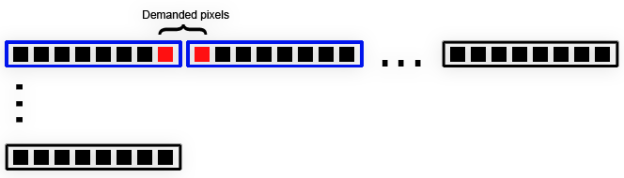

## **原始数据处理**
为了提高Aspose.PSD API的性能，我们在版本2.4.0中引入了一种原始数据处理方法。原始数据处理现在内部使用，并具有外部API，因此可以从库外部使用以提高整体性能。有时处理变得有些棘手并需要一些解释。目前，原始数据处理仅适用于BMP格式。

为了帮助开发人员获得最佳性能，Aspose.PSD API提供了一个原始数据处理系统，其中包含用于定制的外部API。开发人员调用LoadRawData和SaveRawData方法系列以使用原始数据处理。这些方法还需要使用RawDataSettings类设置所需的原始数据格式。RawDataSettings类允许开发人员指定任何原始数据格式。但是，为了获得最佳性能，您需要使用数据存储的原始数据格式。RasterImage类中定义的RawDataSettings有助于确定图像的原始数据格式。将RawDataSettings实例传递给LoadRawData方法时，数据将原样返回，没有应用任何转换，并且可能提高性能。另一方面，您需要处理可能有时有点复杂的所有可能的原始数据格式布局。

为了简化处理过程，可以通过对所需的原始数据设置进行实例化和初始化来指定所需的RawDataSettings，尽管会对性能产生一些损失。有些情况下，不可能以指定格式返回原始数据（例如，从CMYK颜色空间转换为RGB在2.4.0版本中不可用）。此外，有时候图像格式根本不支持原始数据处理。要确定是否可以使用LoadRawData和SaveRawData方法系列，您需要查询IsRawDataAvailable属性。

### **洞察**
对于RGB像素数据格式，存在索引（基于调色板）和基于RGB的原始数据格式。索引原始数据格式包含0..(2^bis count – 1)范围内的调色板条目索引。索引原始数据格式为每像素1、2、4和8位。其余为基于RGB的原始数据格式。在加载原始数据时，请确保有足够的字节可用以加载数据，否则将抛出适当的异常。您可以简单地通过将行大小乘以所需的行数来估算字节数组大小。行大小可能会有所不同，这取决于原始数据存储格式。

为了获得最佳性能，请始终使用与RasterImage.RawLineSize属性值相等的原始数据行大小。但是，有时候您可能需要向原始数据行添加额外的填充或减少填充，如果这种情况发生，则可能需要使用不同的行大小。如果需要图像边界矩形的子集，则需考虑为索引RGB像素格式进行位移。例如，让我们考虑一个尺寸为100x100像素且每像素1位的原始数据格式的图像。您想要加载位置为(7,0)并且尺寸为(2,1)的原始数据矩形，或者换句话说，您需要从x=7和y=0开始获取2像素。在这种情况下，您应该收到以下数据布局：

这意味着您会收到2个字节，第一个字节包含7个不需要的像素，然后1个所需像素，第二个字节包含1个所需像素，然后是7个不需要的像素。您可能会问为什么我们没有执行数据移位并将这两个像素放入一个字节中？答案很简单：为了保持性能高。所有内部处理通常从第一个像素开始，以最后一个可用像素结束。很少有情况需要像素子集。此外，我们不知道这些像素之后将如何处理，因此移位会降低性能并使代码不必要地复杂化。始终估算需求像素会从哪个正确的位开始（无需确定正确的字节，因为数据始终带有填充的第一个字节）。可以使用简单的公式来计算正确的位：(rect.Left * bitsCount) % 8。

### **索引RGB色彩转换**
为了获得尽可能高的性能，请始终使用相同的源和目标原始数据设置、像素格式和行大小。但是，有时候您可能需要执行数据转换。例如，您可以加载每像素1位的RGB图像，并将其保存为每像素2位，或者加载一个4位RGB图像并将其颜色范围降级为每像素2位。在任一情况下，都应该应用颜色转换。有时候，转换索引RGB图像可能有些棘手，而且如果不应用一些设置是无法执行的。我们需要确定源色彩范围是如何映射到目标色彩空间的。为了完成此任务，我们有不同的模式：

- 调色板映射（DitheringMethods.PaletteConversion）
- 原始数据映射（DitheringMethods.PaletteIgnore）
- 自定义转换（DitheringMethods.CustomConverter）

当使用调色板转换时，源色彩空间会尝试尽可能接近目标色彩空间。例如，假设我们有一个包含以下颜色的4位图像：
[0] RGB=0, 0, 0
[1] RGB=17, 17, 17
[2] RGB=34, 34, 34
[3] RGB=51, 51, 51
[4] RGB=68, 68, 68
[5] RGB=85, 85, 85
[6] RGB=102, 102, 102
[7] RGB=119, 119, 119
[8] RGB=136, 136, 136
[9] RGB=153, 153, 153
[10] RGB=170, 170, 170
[11] RGB=187, 187, 187
[12] RGB=204, 204, 204
[13] RGB=221, 221, 221
[14] RGB=238, 238, 238
[15] RGB=255, 255, 255

源图像如下所示：

然后将4位图像转换为以下调色板颜色定义的1位图像：

[0] RGB = 0, 0, 0
[1] RGB = 255, 255, 255

在调色板转换模式下，转换器会读取源颜色并使用目标调色板的GetNearestColorIndex方法确定目标索引。如果调色板的GetNearestColorIndex方法给出超出范围的索引，则使用RasterImage.RawFallbackIndex属性值。这会将源颜色转换为在强度值方面最接近的目标颜色。目标图像尽可能与源图像相匹配。您可以看到以下结果：

在原始数据映射模式下使用不同的情形。源和目标调色板将被简单地忽略，源索引将映射到目标索引。当找到无法映射到目标范围的值（降低位数时）时，将使用RasterImage.RawFallbackIndex属性值。该值默认为0，并且将映射到目标调色板中的第一种颜色。如果此属性值超出目标范围，则将抛出适当的异常。这会导致结果变得不可预测，如下图所示：

调色板转换模式是颜色映射问题的较正确解决方案，但是完成这些计算需要一些时间，因为需要执行计算以估算正确的调色板映射。 （通常两种方法之间几乎没有性能差异。）另一方面，原始映射模式执行速度略快，可用于更加粗糙的颜色转换，此时确切颜色映射并不那么重要。例如，有些情况下源调色板是修剪的，并且可以安全地转换为更低的位数，因为额外的位没有被使用。

要使用任何这些方法之一，请使用RasterImage类的RawDitheringMethod属性。默认情况下，它设置为调色板转换方法，以获得最佳视觉效果。您可以在进行任何转换之前更改此属性（例如，将图像保存到流时）。请注意，如果您加载图像并重新编写部分原始像素数据，则调色板忽略和调色板转换抖动方法不会发生，因为新数据存储在缓存中，并且缓存以最大可用格式32ARGB（截至2.4.0版本，可能会更改）存储数据。此格式用于解决加载和保存图像的可能不同颜色范围的问题。此外，如果以RGB模式加载图像并将其转换为索引模式或反之则将忽略调色板忽略和调色板转换抖动方法。

### **自定义颜色转换器**
有时，使用标准的颜色转换方法可能不足够。您可能希望使用自定义算法来完全自定义颜色转换例程。当源和目标图像的像素格式都是索引RGB格式时，可以使用更简单的界面IIndexedColorConverter。您需要将RasterImage.RawIndexedColorConverter属性设置为IIndexedColorConverter接口的实例，并将RawDitheringMethod属性值设置为DitheringMethods.CustomConverter。在这种情况下，任何索引颜色转换都会通过指定的IIndexedColorConverter实例进行。自定义索引颜色转换器定义了以下方法：



 void FillIndexedtoIndexedMap(byte[] map, PixelDataFormat sourceFormat, PixelDataFormat destFormat);



当需要从索引RGB图像转换为索引RGB图像格式时（当1、2、4或8位数之间进行转换时）将调用FillIndexedtoIndexedMap方法。映射数组的长度等于所有可能的源格式条目数。您需要填充该数组以将源调色板条目映射到目标调色板条目。请注意，目标索引值应在0..(位数 - 1)范围内，否则将抛出适当的异常。

如果要执行更自定义的颜色转换场景，则应将RasterImage.RawCustomColorConverter属性设置为IColorConverter接口的实例。如果同时设置了RawCustomColorConverter属性和RawIndexedColorConverter属性，则始终会覆盖RawIndexedColorConverter属性，并且在这种情况下不会使用索引颜色转换器。IColorConverter有一个方法：



 int Convert(PixelDataFormat sourceFormat, byte[] data, int offset, int bitStart, int samplesCount, int linesCount, PixelDataFormat destFormat, byte[] outputData, int outputOffset); 



每次需要颜色转换时都会调用Convert方法。该方法接收源格式中的源原始数据并具有接收目标颜色格式转换后的颜色数据的输出缓冲区。目标缓冲区应足够大以接收转换后的数据（如果Aspose.PSD库内部进行接口调用）。应在方法返回时包含转换后的原始数据。Convert方法可能被多次调用，直到覆盖整个源数据。