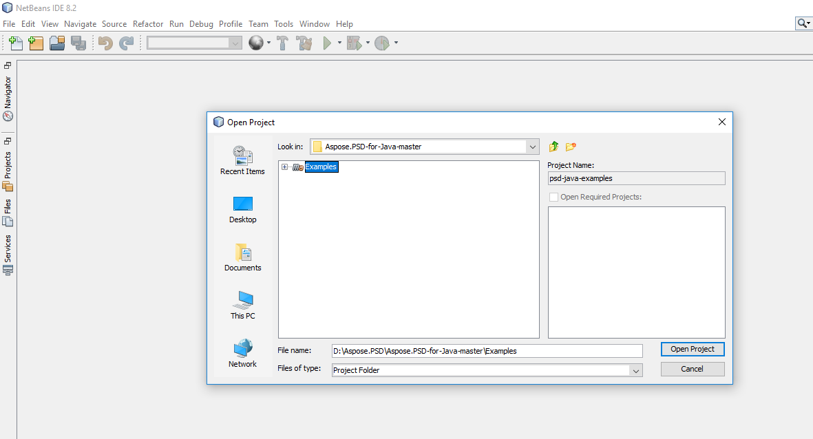

## **从 GitHub 下载**
所有 Aspose.PSD for Java 示例都托管在 [Github](https://github.com/aspose-psd/Aspose.PSD-for-Java) 上。您可以使用 Github 客户端克隆存储库，也可以从 [这里](https://github.com/aspose-psd/Aspose.PSD-for-Java/archive/master.zip) 下载 ZIP 文件。

在计算机上解压 ZIP 文件的内容。您将找到 **Examples** 文件夹。所有示例都位于 **Examples** 文件夹中。

您可以使用任何 IDE 运行/执行这些示例，但为了演示目的，我们使用 **NetBeans**。使用 **文件 -> 打开** **项目** 选项导入您选择的示例并指定路径。

在项目中添加所需的 jar 文件（库）。

**Resources** 文件夹包含示例中引用的输入文档/文件。

{} 

您还可以直接从 GitHub 存储库导入示例。

{} 

## **贡献**
如果您想添加或改进示例，我们鼓励您对该项目进行贡献。此存储库中的所有示例和展示项目都是开源的，可以自由在您自己的应用程序中使用。

要贡献，您可以 fork 该存储库，编辑源代码并创建拉取请求。我们将审查更改，并在发现有帮助时将其包含在存储库中。
