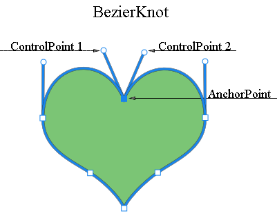

## **图层矢量蒙版概述**
矢量蒙版是一个与分辨率无关的路径，可以剪裁图层的内容。矢量蒙版通常比使用基于像素的工具创建的蒙版更准确。您可以使用钢笔或形状工具创建矢量蒙版。

Aspose.PSD支持渲染和应用矢量蒙版。您可以通过编辑矢量路径来编辑矢量蒙版。
## **Aspose.PSD中的矢量路径**
通过[Vector Path（矢量路径）](https://reference.aspose.com/psd/net/aspose.psd.fileformats.psd.layers.layerresources/vsmsresource) 和[VmskResource（Vmsk资源）](https://reference.aspose.com/psd/net/aspose.psd.fileformats.psd.layers.layerresources/vmskresource)资源提供对Aspose.PSD中矢量路径的访问，它们是[VectorPathDataResource（矢量路径数据资源）](https://reference.aspose.com/psd/net/aspose.psd.fileformats.psd.layers.layerresources/vectorpathdataresource)的子类。

## **如何编辑矢量路径？**
### **矢量路径结构**
用于操作路径的基本结构是[VectorPathRecord（矢量路径记录）](https://reference.aspose.com/psd/net/aspose.psd.fileformats.core.vectorpaths/vectorpathrecord)。但为了您的方便，建议使用以下解决方案。

要轻松编辑矢量路径，应使用[VectorPath（矢量路径）](https://gist.github.com/aspose-com-gists/8a4c9d34ce856d1642fc7c0ce974175c#file-examples-csharp-aspose-workingwithvectorpaths-classestomanipulatevectorpathobjects-classestomanipulatevectorpathobjects-cs)类，其中包含用于舒适编辑来自VectorPathDataResource派生的资源中矢量数据的方法。

开始创建一个VectorPath类型的对象。

为了方便起见，您可以使用静态方法[VectorDataProvider.CreateVectorPathForLayer（为图层创建矢量路径）](https://gist.github.com/aspose-com-gists/8a4c9d34ce856d1642fc7c0ce974175c#file-examples-csharp-aspose-workingwithvectorpaths-classestomanipulatevectorpathobjects-classestomanipulatevectorpathobjects-cs)，它将在输入图层中找到矢量资源并基于此创建一个VectorPath对象。

编辑完成后，您可以使用静态方法[VectorDataProvider.UpdateLayerFromVectorPath（从矢量路径更新图层）](https://gist.github.com/aspose-com-gists/8a4c9d34ce856d1642fc7c0ce974175c#file-examples-csharp-aspose-workingwithvectorpaths-classestomanipulatevectorpathobjects-classestomanipulatevectorpathobjects-cs)将带有更改的VectorPath对象应用回图层。



VectorPath类型包含[PathShape（路径形状）](https://gist.github.com/aspose-com-gists/8a4c9d34ce856d1642fc7c0ce974175c#file-examples-csharp-aspose-workingwithvectorpaths-classestomanipulatevectorpathobjects-classestomanipulatevectorpathobjects-cs)元素的列表，并描述可以由一个或多个形状组成的整个矢量图像。

每个PathShape是一个包含独立贝塞尔结（点）集合的矢量图形。

结是类型为[BezierKnot（贝塞尔结）](https://gist.github.com/aspose-com-gists/8a4c9d34ce856d1642fc7c0ce974175c#file-examples-csharp-aspose-workingwithvectorpaths-classestomanipulatevectorpathobjects-classestomanipulatevectorpathobjects-cs)的对象，本质上是构建图形的点。

以下代码示例显示如何访问图形和点。


### **如何创建形状？**
要编辑形状，需要从[VectorPath.Shapes（形状）](https://gist.github.com/aspose-com-gists/8a4c9d34ce856d1642fc7c0ce974175c#file-examples-csharp-aspose-workingwithvectorpaths-classestomanipulatevectorpathobjects-classestomanipulatevectorpathobjects-cs)列表中获取现有形状，或通过创建[PathShape（路径形状）](https://gist.github.com/aspose-com-gists/8a4c9d34ce856d1642fc7c0ce974175c#file-examples-csharp-aspose-workingwithvectorpaths-classestomanipulatevectorpathobjects-classestomanipulatevectorpathobjects-cs)实例并将其添加到[Shapes](https://gist.github.com/aspose-com-gists/8a4c9d34ce856d1642fc7c0ce974175c#file-examples-csharp-aspose-workingwithvectorpaths-classestomanipulatevectorpathobjects-classestomanipulatevectorpathobjects-cs)列表来添加新形状。


### **如何添加结（点）？**
您可以使用PathShape.Points属性将形状的点作为常规列表的元素进行操作，例如，可以添加形状点：



BezierKnot包含锚点和两个控制点。

如果锚点和控制点具有相同的值，则该节点将具有锐角。

要像在Photoshop中那样随控制点一起改变锚点位置，BezierKnot具有一个Shift方法。

以下代码示例演示了如何通过Y坐标垂直向上移动整个贝塞尔结：

可以使用PathShape.Points属性将形状的点作为常规列表的元素进行操作，例如，可以添加形状点：



## **PathShape属性**
对PathShape的编辑不限于编辑节点，此类型还具有其他属性。
### **PathOperations（布尔运算）**
[PathOperations（路径操作）](https://reference.aspose.com/psd/net/aspose.psd.fileformats.core.vectorpaths/pathoperations)属性是所谓的布尔操作，更改其值定义了如何混合多个形状。

以下是可能的值：

- 0 = ExcludeOverlappingShapes（XOR操作）。
- 1 = CombineShapes（OR操作）。
- 2 = SubtractFrontShape（NOT操作）。
- 3 = IntersectShapeAreas（AND操作）。

### **IsClosed属性**
同样，通过使用PathShape.IsClosed属性，我们可以确定形状的第一个和最后一个结是否连接。

| **封闭形状** | **开放形状** |
| :- | :- |
|  |  |
### **FillColor属性**
没有形状可以拥有自己的颜色，因此您可以使用VectorPath.FillColor属性更改整个矢量路径的颜色。

可以使用PathShape.Points属性将形状的点作为常规列表的元素进行操纵，例如，可以添加形状点：



## **您将在这里找到VectorDataProvider及相关类的源代码：**

