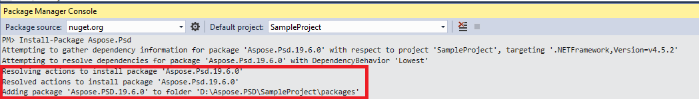

## **通过 NuGet 安装 Aspose.PSD for .NET**
NuGet 是下载和安装 Aspose APIs for .NET 的最简单方法。 打开 Microsoft Visual Studio 和 NuGet 包管理器。 搜索 "aspose" 以找到所需的 Aspose API。 单击 "安装"，所选 API 将被下载并引用到您的项目中。

## **使用包管理器控制台安装或更新 Aspose.PSD**
您可以按照以下步骤使用包管理器控制台引用[Aspose.PSD API](https://www.nuget.org/packages/Aspose.psd/)：

1. 在 Visual Studio 中打开您的解决方案/项目。
1. 从菜单中选择 Tools -> Library Package Manager -> Package Manager Console 以打开包管理器控制台。

键入命令“**Install-Package Aspose.Psd**”，然后按 Enter 键安装最新的完整版本到您的应用程序中。 或者，您可以在命令中添加“**-prerelease**”后缀，以指定也要安装包括热修复的最新版本。

您将看到**"安装 Aspose.PSD"**提示出现在窗口底部，指示下载正在进行。

下载完成后，您将看到以下确认消息。如果您对[Aspose EULA](https://company.aspose.com/legal/eula)不熟悉，建议阅读链接中引用的许可证。

您应该现在可以在您的应用程序中成功添加并引用 Aspose.PSD。

在包管理器控制台中，您还可以使用命令“**Update-Package Aspose.Psd**”，然后按 Enter 键检查是否存在对 Aspose.Psd 包的任何更新，并在存在时安装它们。 您还可以添加“-prerelease”后缀以更新为最新版本。

## **在共享服务器环境中运行时的注意事项**
建议所有 Aspose .NET 组件以完全信任权限集运行。 这是因为 Aspose .NET 组件有时需要访问注册表设置和位于虚拟目录之外的位置的文件，例如用于读取字体等。 此外，Aspose.NET 组件基于核心 .NET 系统类，其中一些在某些情况下也需要完全信任权限才能运行。

托管来自不同公司的多个应用程序的互联网服务提供商通常强制执行中等信任级别的安全性水平。 对于 .NET 2.0，此安全级别可能设置以下约束，这可能会影响 Aspose.Words 执行的能力。

- **RegistryPermission** 不可用。 这意味着无法访问注册表，在呈现文档时需要列举已安装的字体。
- **FileIOPermission** 受限制。 这意味着您只能访问应用程序的虚拟目录层次结构中的文件。 这可能意味着无法在导出期间读取字体。

基于上述原因，建议 Aspose.PSD 在完全信任权限下运行。 您可能会发现，当在中等信任情况下执行不同任务时，库的某些功能将正常工作，而某些功能不会（例如呈现），这可能是由于对 GDI+ 图像处理的调用。

## **使用通过 MSI 包安装的 .NET Core DLL 进行工作**

**请注意：**如果您使用通过 MSI 包安装的 .Net Standard dll，则应添加必要的依赖项以使用 .Net Standard 版本。

|**Visual Studio 依赖项截图**|**CsProj 文件片段:**|
| :- | :- |
||<ItemGroup>

`    `<PackageReference Include="System.Drawing.Common" Version="4.5.1" />

`    `<PackageReference Include="System.Text.Encoding.CodePages" Version="4.5.0" />

</ItemGroup>|

## **系统需求**
### **支持的操作系统：**
- Microsoft Windows 2000 专业版和服务器版（建议安装 SP2）
- Microsoft Windows XP 专业版和家庭版
- Microsoft Windows 2003 服务器
- Microsoft Windows Vista
- Microsoft Windows 2008 服务器
- Microsoft Windows 2008 服务器 R2
- Microsoft Windows 7
- Microsoft Windows 8
- Microsoft Windows 10
- Microsoft Windows 11
### **支持的平台：**
- 窗体应用程序
- Web 窗体应用程序
- Visual Studio 2005
- Visual Studio 2008
- Visual Studio 2010
- Visual Studio 2012
- Visual Studio 2013
- Visual Studio 2015
- Visual Studio 2017
- Visual Studio 2019
- Visual Studio 2022

Aspose.PSD 适用于上述列出的操作系统的 x86 和 x64 版本。
### **支持的框架：**
Aspose.PSD for .NET 支持以下 .NET 框架：

- .NET Framework 版本 2.0 或更高
- .NET Standard 2.0
